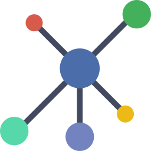

### Explore-iT : Map Based Real Time Micro Blogging App



[]() []() []() []()

A GraphQL API based real-time map based micro blogging app. I created this project to learn about graphql API development from scratch, this project includes all major aspects of graphql stack like queries, mutation, subscription, Apollo client-server pattern.

[](https://explore-itb.herokuapp.com)

#### What this app do?

- Sign-In/Sign-out with Google Account.
- Mark temporary pin on map.
- Add small blog about that pined place with picture and add it to map as persistent.
- After Added to map, all others user can see that updated pin in real time.
- Any sign-in user can do comments on pinned places.
- Edit/Delete any posted pinned places and comments.
- All changes will be in real time.
- It uses cloudinary service for image upload and cdn.

##### Stack:

[]() []() []() []() []() []()

##### How to run locally?

```bash
#Clone project
git clone https://github.com/MasterKN48/Explore-iT
# make .env in project dir and edit
PORT=8000
NODE_ENV=dev
DB='mongodb://localhost:27017/<DB_Name>'
CLIENT_ID=<Google-OAuth-Client-Id>
CLIENT_SECRET=<Google-OAuth-Secret>
# edit client/src/component/Auth/Login
# Change clientId=<Google-OAuth-Client-Id>
# edit client/src/componenet/Maps/Pin/CreatePin ->
#  <CLOUDINARY_API_URL>
#  <CLOUD_NAME> in same file
# in client dir
npm start
# in root project dir
# in server.js edit cors(<Your_Domain_Name>)
# then start server
npm start dev

```

[]()
